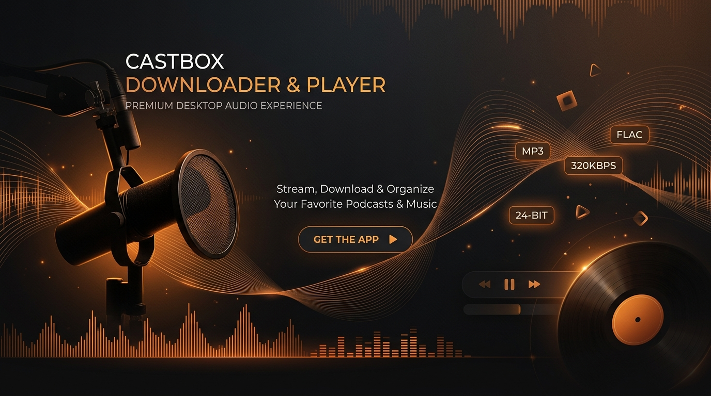
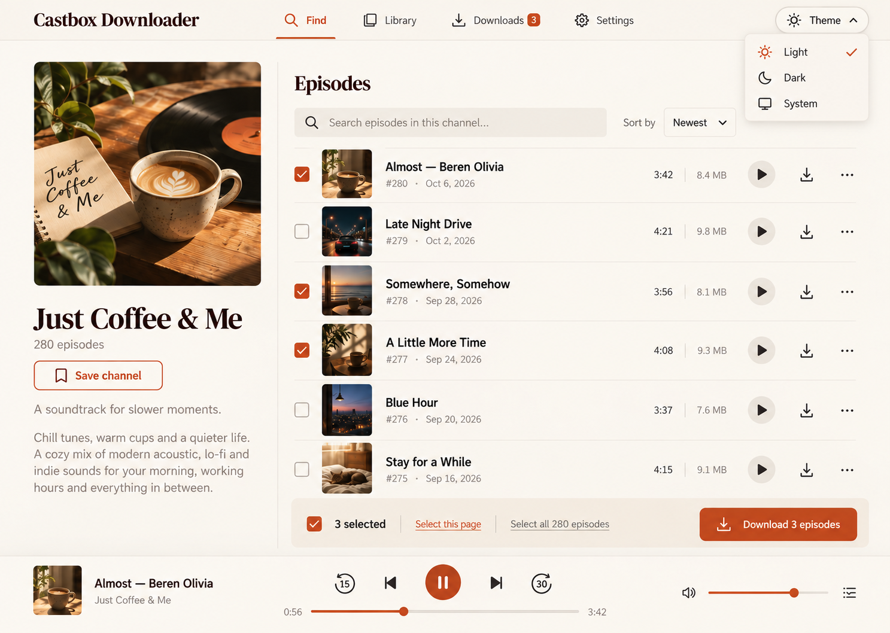
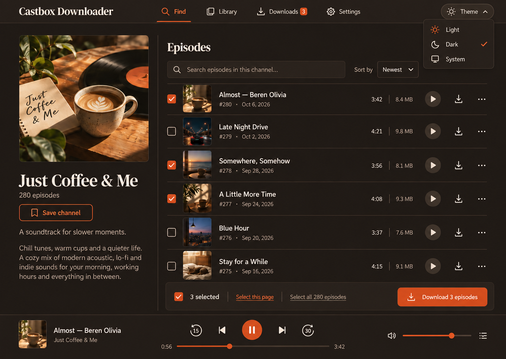
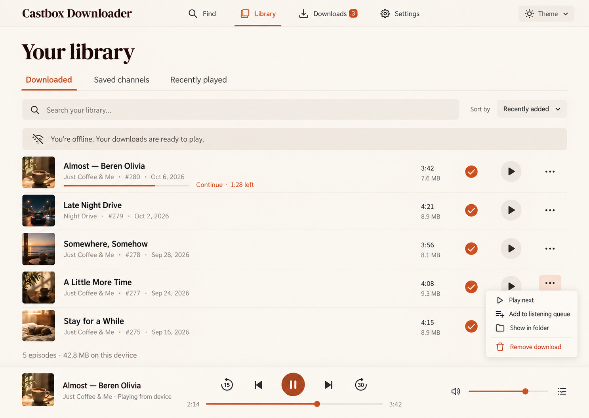
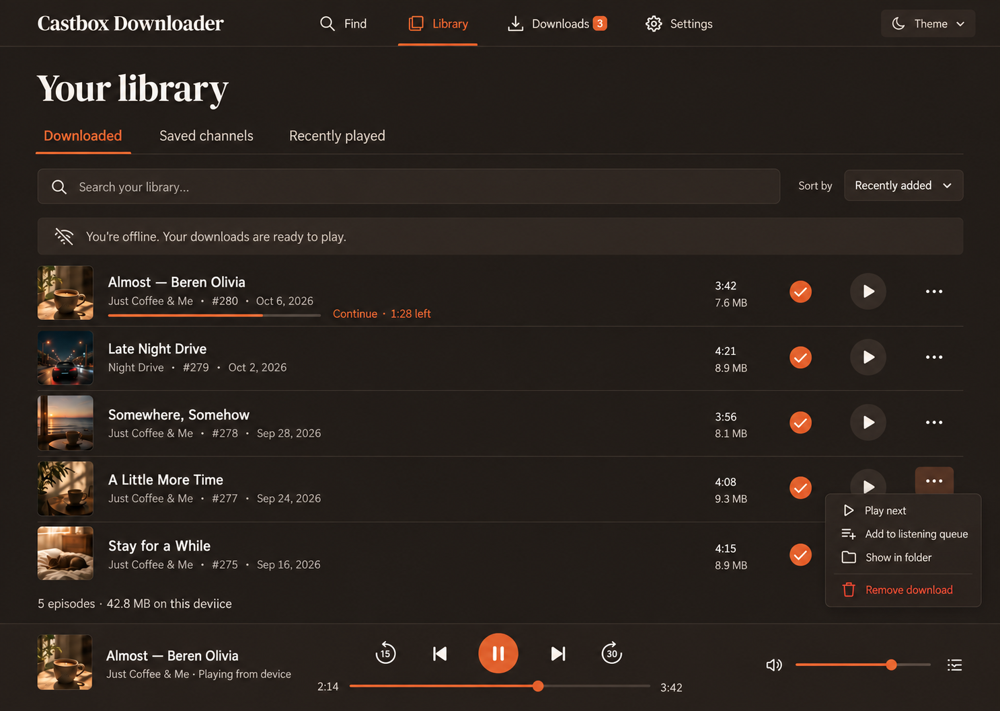
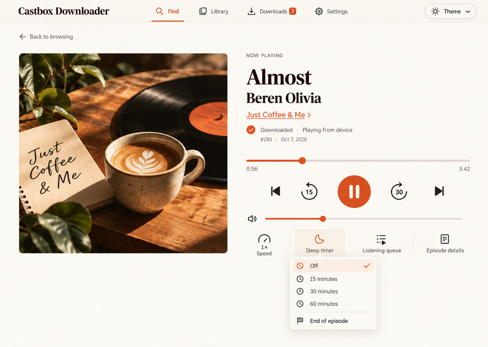
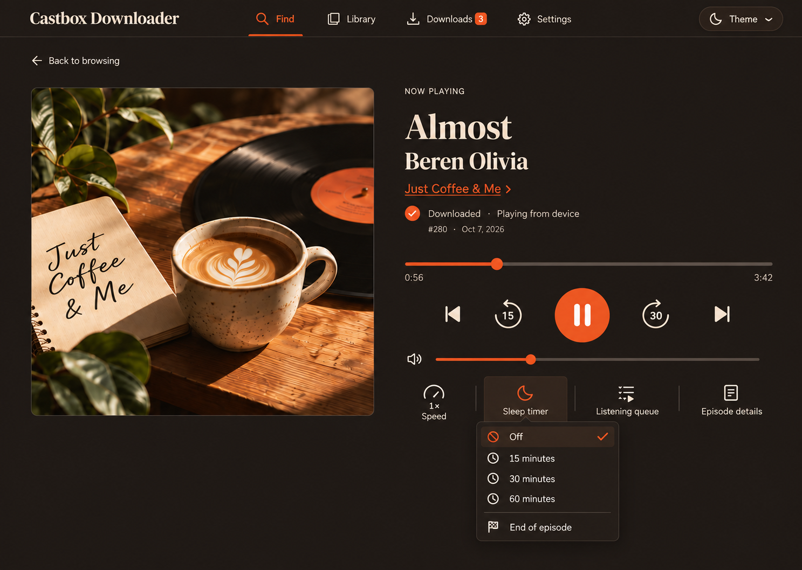
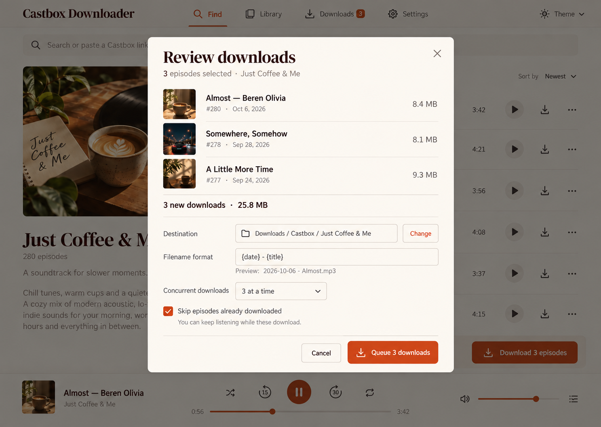
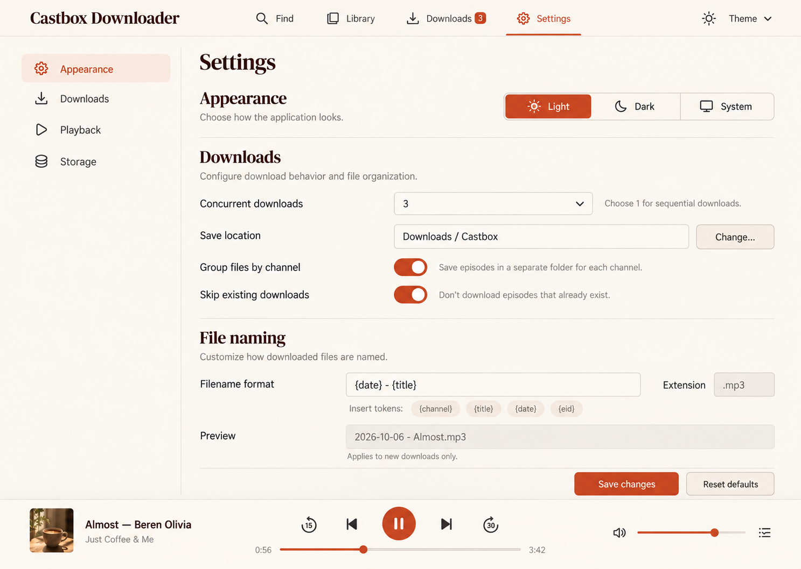

<div align="center">
  

  <h1>CastBox Downloader &amp; Player</h1>
  <p><strong>A world-class, privacy-first desktop application for exploring, downloading, and enjoying podcasts offline.</strong></p>

  <p>
    <a href="https://github.com/EhsanShahbazii/CastBox-Downloder-APP/releases"></a>
    
    
    
    
    
    
  </p>
</div>

---

## 🌟 Overview

**CastBox Downloader & Player** is a desktop application crafted for audiophiles, researchers, and podcast enthusiasts who want complete ownership over their media library. Built on Electron, React, and TypeScript, it pairs a warm editorial design system with a high-performance, fault-tolerant download manager and SQLite-backed local library.

Whether you are archiving educational series, traveling off-grid, or managing large audio collections, CastBox Downloader provides full multi-threaded downloads, chunked resume, customizable filename templates, and seamless personal token authentication.

---

## ✨ Key Features

### 🔍 Discovery & Live Catalog
- **Instant Search & Autocomplete:** Real-time channel and episode lookups using Castbox's global catalog API.
- **Deep Link Resolution:** Paste any `castbox.fm` show or episode URL for instant navigation.
- **Rich Show Metadata:** High-resolution cover artwork, full descriptions, release dates, episode durations, and file sizes.

### ⚡ Resilient Download Engine
- **Multi-Stream Concurrency:** Download up to 5 episodes simultaneously with configurable bandwidth limits.
- **Interruption Recovery & ETag Validation:** Resume broken downloads without redownloading transferred bytes, backed by strong HTTP ETag verification.
- **Atomic File Publishing:** In-flight downloads are written to private temporary buffers (`.part`) and atomically published to prevent partial or corrupted audio files.
- **Customizable File Naming:** Format filenames with smart tokens (`{channel}`, `{title}`, `{date}`, `{eid}`) and group downloads by channel directory.
- **Safe Duplicate Handling:** Explicit options to skip, rename, or overwrite existing media with zero risk of file aliasing.

### 🎧 Built-in Hi-Fi Audio Player & Queue
- **Persistent Bottom Player:** Seamless mini-player available on every screen with playback controls, progress scrubbing, and volume management.
- **Expanded Player View:** Dedicated distraction-free listening mode with big album art and fine-grained controls.
- **Variable Playback Speed:** 0.5×, 0.75×, 1.0×, 1.25×, 1.5×, 1.75×, and 2.0× pitch-corrected speed presets.
- **Sleep Timer:** Automatic stop timers (15m, 30m, 60m, or end-of-episode).
- **Listening Queue:** Reorderable, persistent offline queue that remembers where you left off.

### 📚 Local Library & Storage Management
- **Local SQLite Database:** Fast search, filtering, and sorting by publication date, download completion time, duration, or size.
- **Health Check & Relocation:** Automatic detection of missing or moved files with one-click path relocation.
- **Storage Diagnostics:** Real-time visual disk usage indicators and cache clearing.

### 🔐 User Authentication & Personal Token Support
- **Personal Token Dispatch:** Enter your personal Castbox `x-access-token` and optional secret to download private shows, premium subscriber content, and bypass anonymous rate limits.
- **Zero-Cloud Privacy:** All tokens and credentials are saved locally in OS user data (`settings.json` with strict `0600` permissions) and are never logged, synced, or sent to third-party servers.

---

## 🖼️ User Interface Showcase

CastBox Downloader features an editorial aesthetic with warm paper backgrounds, espresso typography, burnt-orange actions, and dark mode.

<table>
  <tr>
    <th width="50%">Channel View · Light Theme</th>
    <th width="50%">Channel View · Dark Theme</th>
  </tr>
  <tr>
    <td></td>
    <td></td>
  </tr>
  <tr>
    <th>Local Library · Light Theme</th>
    <th>Local Library · Dark Theme</th>
  </tr>
  <tr>
    <td></td>
    <td></td>
  </tr>
  <tr>
    <th>Expanded Player · Light Theme</th>
    <th>Expanded Player · Dark Theme</th>
  </tr>
  <tr>
    <td></td>
    <td></td>
  </tr>
  <tr>
    <th>Batch Download Review</th>
    <th>Application Settings &amp; Auth</th>
  </tr>
  <tr>
    <td></td>
    <td></td>
  </tr>
</table>

---

## 🏗️ Architecture & Security Model

```
┌────────────────────────────────────────────────────────┐
│               React Renderer (UI Shell)                │
│   • Tailwind CSS Design Tokens   • Lucide Icons         │
│   • Virtualized Episode Lists    • Web Audio / Player   │
└──────────────────────────┬─────────────────────────────┘
                           │ contextBridge (Preload)
                           ▼
┌────────────────────────────────────────────────────────┐
│             Electron Main Process (Trusted)            │
│  ┌─────────────────────────┐ ┌──────────────────────┐  │
│  │   Catalog HTTP Client   │ │   Download Planner   │  │
│  │  (Permuted Web Digest & │ │  (Path Sanitization  │  │
│  │   Auth Token Injection) │ │  & Directory Grants) │  │
│  └───────────┬─────────────┘ └──────────┬───────────┘  │
│              ▼                          ▼              │
│  ┌─────────────────────────┐ ┌──────────────────────┐  │
│  │     SQLite Database     │ │   Transfer Engine    │  │
│  │ (Saved Shows, Queue,    │ │  (Range Chunks, ETag │  │
│  │  Progress & Downloads)  │ │   Atomic Publishing) │  │
│  └─────────────────────────┘ └──────────────────────┘  │
└────────────────────────────────────────────────────────┘
```

- **Context Isolation & Sandboxing:** The renderer operates strictly within Electron's sandboxed environment without Node.js primitives or arbitrary filesystem access.
- **Explicit Directory Grants:** The app accesses only the user-designated download directory selected via OS native dialogs.
- **Path Sanitization:** Filename tokens are stripped of directory traversal vectors (`../`), Windows reserved device names (`CON`, `PRN`), and unsupported characters.
- **IPC Origin Validation:** All IPC invocations verify the sender webFrame against registered internal application origins.

---

## 🚀 Quick Start

### Prerequisites
- [Node.js](https://nodejs.org/) LTS (v20+ recommended)
- `npm` (v10+)
- `git`

### Installation

```bash
# 1. Clone the repository
git clone https://github.com/EhsanShahbazii/CastBox-Downloder-APP.git
cd CastBox-Downloder-APP

# 2. Install dependencies
npm ci

# 3. Build & launch the desktop application
npm start
```

### Development Scripts

| Command | Action |
| --- | --- |
| `npm start` | Builds frontend & desktop bundle, launches Electron |
| `npm run build` | Full production build with TypeScript check |
| `npm test` | Runs the comprehensive 74-test unit and regression suite |
| `npm run check` | Combined build verification and test runner |
| `npm run dev:ui` | Starts Vite hot-reload server for frontend development |

---

## 🔑 How to Setup Personal User Token

By default, CastBox Downloader functions in anonymous mode. To download private episodes, access subscriber subscriptions, or avoid public rate limits:

1. Open your browser and log into [castbox.fm](https://castbox.fm).
2. Open **Developer Tools** (`F12` or `Cmd + Option + I`) and switch to the **Network** tab.
3. Refresh or click on any episode to trigger a request to `everest.castbox.fm`.
4. Select the request and inspect **Request Headers**.
5. Copy the value of the `x-access-token` header.
6. Open **CastBox Downloader → Settings → Account & Auth**.
7. Paste your token and click **Save changes**.

> [!NOTE]
> Your credentials are encrypted and stored in `settings.json` locally on your machine with `0600` access permissions. They are never transmitted anywhere except directly to Castbox's official API.

---

## 🧪 Testing & Verification

The test suite covers:
- **Web Query Permutation:** Algorithmic verification of Castbox daily query digest signatures.
- **Download Planner Security:** Traversal attacks, reserved Windows device tokens, case collision renames, and atomic directory reservations.
- **Stream Resumption:** Verified byte append, strong ETag mismatches, truncated payload recovery, and cancel rollbacks.
- **SQLite Storage Migrations:** Database version upgrades, index integrity, and corrupt database preservation.
- **User Token Injection:** Validation that user authentication headers are properly mounted and isolated.

Run tests at any time with:
```bash
npm test
```

---

## 📜 License

Distributed under the MIT License. See [LICENSE](LICENSE) for more information.

---

<div align="center">
  <sub>Developed with ❤️ by <a href="https://github.com/EhsanShahbazii">Ehsan Shahbazi</a></sub>
</div>
